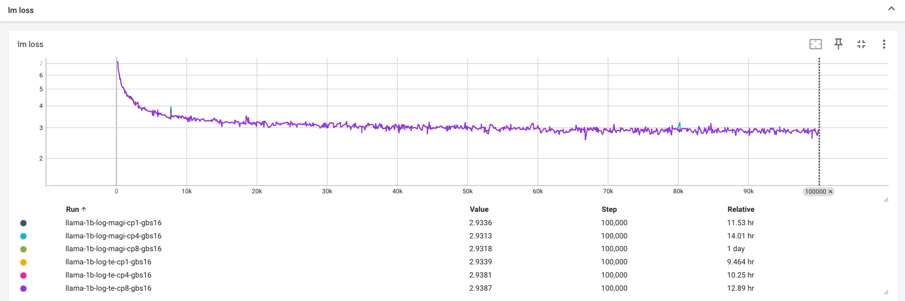

## train llama-3-1b with magiattention
We provide an example for you to train llama-3-1b with magiattention with different cp size. 

### Prepare checkpoints
You can refer to the shell in dir magiattention/checkpoints/ and
run `prepare_llama-3.2-1b_checkpoint.sh` to download checkpoint from modelscope and convert checkpoint from huggingface format to megatron format.

tokenizer.model is necessary for trainingcle from scratch.

### Prepare data
We use openwebtext(https://huggingface.co/datasets/Skylion007/openwebtext) dataset.

You can run `prepare_data.sh` in ./data to download data from huggingface and preprocess data.

### Integrate with magiattention
We integrate magiattention with transformer_engine and local transformer inplementation.
Main changes:
- modify `./magi_attention/pretrain_gpt.py` for magi_attention.
    - mainly change `dispatch_along_cp_rank`, `prepare_data` and `prepare_magi_attention` function:
```diff
    def get_batch(data_iterator):
        """Generate a batch."""
        batch = get_batch_on_this_tp_rank(data_iterator)
-       batch = get_batch_on_this_cp_rank(batch)
+       batch = dispatch_along_cp_rank(batch)

        return batch.values()

+   def dispatch_along_cp_rank(batch: Dict[str, Any]):
        ...
        # squash batch dim for token and label and compute pad_size
+       tokens, labels, cu_seqlens_q, cu_seqlens_k, pad_size = prepare_data(tokens, labels)
+       input, dist_attn_runtime_key = prepare_magi_attention(
+              tokens, cu_seqlens_q, cu_seqlens_k, pad_size, mpu.get_context_parallel_group())
        # update dict key
        ...
        return batch

+   def prepare_magi_attention(input, cu_seqlens_q, cu_seqlens_k, pad_size, cp_group):
+       dist_attn_config = DistAttnConfig()
+       ...
+       x_padded, dist_attn_runtime_key = magi_attn_varlen_dispatch(
+       input,
+       cu_seqlens_q,
+       cu_seqlens_k,
+       head_dim=head_dim,
+       pad_size=pad_size,
+       cp_group=cp_group,
+       causal=True,
+       dist_attn_config=dist_attn_config,
+       )
+       return x_padded, dist_attn_runtime_key

    def forward_step(data_iterator, model: GPTModel):
        ...
        with stimer(bdata=True):
-            tokens, labels, loss_mask, attention_mask, position_ids = get_batch(
-                data_iterator)
+           tokens, labels, loss_mask, attention_mask, position_ids, key = get_batch(
+                data_iterator)

        ...
-       output_tensor = model(tokens, position_ids, attention_mask,
-                              labels=labels)
+       output_tensor = model(tokens, position_ids, attention_mask,
+                           labels=labels, magi_attention_key=key)
        
        return output_tensor, partial(loss_func, loss_mask)

```

- add `megatron/core/transformer/magi_attention.py` for magiattention implementation.
- replace core_attention with magi_attention in `megatron/core/models/gpt/gpt_layer_specs.py` for local transformer_impl.
- replace forward function of `TEDoctProductAttention` with magi_attention forward function for Te transformer_engine transformer_impl.
```diff
    class TEDotProductAttention(te.pytorch.DotProductAttention):
        def __init__():
            ...
+           self.magi_attention = MagiAttention(config=config, 
+                                           layer_number=layer_number,
+                                           attn_mask_type=attn_mask_type,
+                                           attention_type=attention_type,
+                                           attention_dropout=attention_dropout,
+                                           softmax_scale=softmax_scale)
            ...

        def forward():
+           core_attn_out = self.magi_attention.forward(query=query, key=key, value=value, attention_mask=attention_mask, attention_bias=attention_bias, packed_seq_params=None, magi_attention_key=magi_attention_key)
+           return core_attn_out
            '''
-                core_attn_out = super().forward()
            '''
```
- pass `magi_attention_key` through gpt model forward pass.
- replace `get_pos_emb_on_this_cp_rank` with `get_pos_emb_on_this_cp_rank_magi` for rope.
```diff
- def get_pos_emb_on_this_cp_rank(pos_emb: Tensor, seq_dim: int) -> Tensor:
-    ...

+ def get_pos_emb_on_this_cp_rank_magi(pos_emb: Tensor, magi_attention_key) -> Tensor:
+     from magi_attention.api import get_position_ids
+
+     cp_idx = get_position_ids(magi_attention_key)
+     pos_emb = pos_emb[cp_idx]
+
+     return pos_emb
```

shells:
- `train_llama_1b_from_scratch.sh`: You can run this shell to train llama-1b model from scratch.
- `resume_from_checkpoint.sh`: You can run this shell to train llama-1b model from megatron checkpoint.
- `run_llama_from_checkpoint.sh`: You can run this shell to train llama-1b model from checkpoint converted from hugging face format.

### Experiments
You can run `train_llama_1b_from_scratch.sh` to train llama-1b from scratch with magiattention.

training_settings:
- model-size: llama-1b
    - num-layers: 16
    - hidden-size: 2048
    - num-attention-heads: 32
    - group-query-attention
    - num-query-groups: 8
- seqlen: 8192
- context_parallel_size: cp1/2/4/8(magiattention vs te ring attention) with global batch size 16.
- train_iters: 100000

Results:
MagiAttention aligns well with te ring attention.
 

Feel free to open any issue in this repo if you have any question!