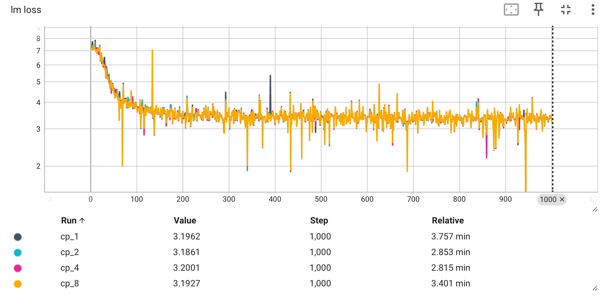

## train llama-3.2-1b with checkpoint
We provide an example for you to train llama-3.2-1b with different cp size. 

### prepare checkpoints
You can refer to the shell in dir checkpoints/
run download shell to download checkpoint from modelscope and run convert shell to transformer huggingface format checkpoint to megatron format.

### prepare data
We use openwebtext here to continue training megatron.
run prepare_data to download data from huggingface and preprocess data.

### experiments
You can run run_llama_all.sh to do experiments with megatron cp1/2/4/8 and observe how the loss change.

results:
